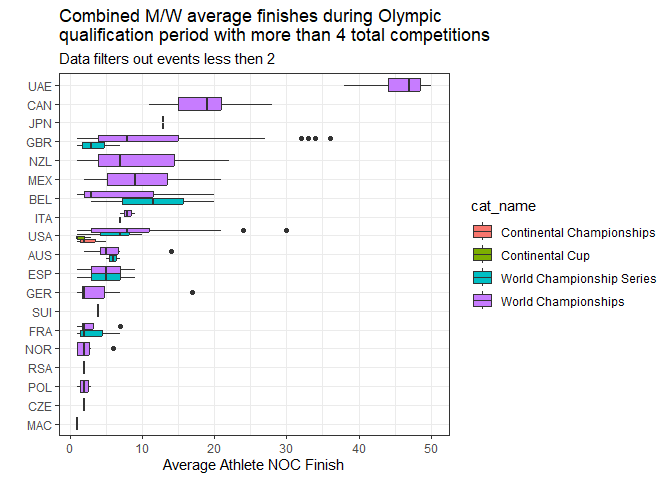

<!-- README.md is generated from README.Rmd. Please edit that file -->

# rTriathlon

<!-- badges: start -->
<!-- badges: end -->

rTriathlon is a client for <https://www.triathlon.org/>.

Resources regarding Triathlon qualifications:

- <https://www.teamusa.org/-/media/USA_Triathlon/PDF/Elite-International/2023/TRI_2024_OLY_ATH_FINAL-With-Signature-NEW.pdf?la=en&hash=327A5F72C8CA11AB41CFEEC84B8D6E1A5CE544C3>

- <https://en.wikipedia.org/wiki/Triathlon_at_the_2024_Summer_Olympics_%E2%80%93_Qualification>

- <https://olympics.com/en/news/pathway-to-paris-triathlon-qualification-system-explained>

- <https://www.triathlon.org/news/article/ioc_approves_the_olympic_qualification_criteria_for_paris_2024_olympics>

- <https://www.triathlon.org/uploads/docs/Paris2024_Olympic_Qualification_Principles.pdf?fbclid=IwAR2daD8STkBG8uBQfAYEXAGFArwEGFUT5xABpDaCYxvp_EPpRpVZ2P-FFV0>

## Installation

You can install the development version of rTriathlon from
[GitHub](https://github.com/) with:

``` r
# install.packages("devtools")
devtools::install_github("tyler-widdison/rTriathlon")
```

## Example

Get a list of triathlon events (this date range happens to be the
Olympic qualification range):

``` r
library(rTriathlon)
#> Loading required package: magrittr
event_list <- tri_get_event_list('2022-05-27', '2024-05-27')
nrow(event_list)
#> [1] 460
```

Get details for a specific event:

``` r
event_id <- event_list$event_id[1:5]
prog_list <- tri_program_list_get(event_id)
prog_list %>% dplyr::select(prog_id, event_id, prog_name) %>% head
#>   prog_id event_id     prog_name
#> 1  560870   168315 Elite Coaches
#> 2  560868   168315     Elite Men
#> 3  560869   168315   Elite Women
#> 4  547740   165006 Elite Coaches
#> 5  547741   165006     Elite Men
#> 6  547742   165006   Elite Women
```

We can then get results from events:

``` r
tri_results_list_get(174221, 583767)
#>    athlete_id           athlete_title    athlete_first athlete_last
#> 1      143563            François Vie         François          Vie
#> 2       10572             Rui Dolores              Rui      Dolores
#> 3      123733          António Barata          António       Barata
#> 4       55786              Tiago Maia            Tiago         Maia
#> 5      124763             Hugo Baluga             Hugo       Baluga
#> 6      143281              Joao Jesus             Joao        Jesus
#> 7      174222              Rui Matias              Rui       Matias
#> 8       81871 Afonso Silvestre Garcia Afonso Silvestre       Garcia
#> 9      123295            David Coelho            David       Coelho
#> 10     133923              Nuno Silva             Nuno        Silva
#> 11     174223            Alex Cabrita             Alex      Cabrita
#> 12     174224            Luís Cancela             Luís      Cancela
#> 13     174225          Ricardo Rosado          Ricardo       Rosado
#> 14     133889             Paulo Ajuda            Paulo        Ajuda
#> 15     174226           Nuno Carvalho             Nuno     Carvalho
#>    athlete_gender validated          updated_at athlete_profile_image
#> 1            male     FALSE 2023-02-02 18:08:40                    NA
#> 2            male     FALSE 2022-12-16 10:54:12                    NA
#> 3            male     FALSE 2023-04-12 11:25:15                    NA
#> 4            male     FALSE 2023-04-12 11:39:37                    NA
#> 5            male     FALSE 2022-12-16 10:54:44                    NA
#> 6            male     FALSE 2022-12-16 10:54:53                    NA
#> 7            male     FALSE 2022-12-16 10:55:24                    NA
#> 8            male     FALSE 2022-12-16 10:55:38                    NA
#> 9            male     FALSE 2022-12-16 10:55:46                    NA
#> 10           male     FALSE 2022-12-16 10:55:59                    NA
#> 11           male     FALSE 2022-12-16 10:56:19                    NA
#> 12           male     FALSE 2022-12-16 10:57:00                    NA
#> 13           male     FALSE 2022-12-16 10:57:38                    NA
#> 14           male     FALSE 2022-12-16 10:57:47                    NA
#> 15           male     FALSE 2022-12-16 10:59:01                    NA
#>           dob athlete_country_id         athlete_edit_date athlete_yob
#> 1  2002-04-02                247 2023-02-02T18:08:40+00:00        2002
#> 2  1984-09-26                247 2022-12-16T10:54:12+00:00        1984
#> 3  1999-11-12                247 2023-04-12T11:25:15+00:00        1999
#> 4  1990-08-01                247 2023-04-12T11:39:37+00:00        1990
#> 5  1996-07-01                247 2022-12-16T10:54:44+00:00        1996
#> 6  1990-05-25                247 2022-12-16T10:54:53+00:00        1990
#> 7  1995-01-23                247 2022-12-16T10:55:24+00:00        1995
#> 8  1995-12-25                247 2022-12-16T10:55:38+00:00        1995
#> 9  1981-05-09                247 2022-12-16T10:55:46+00:00        1981
#> 10 1978-07-08                247 2022-12-16T10:55:59+00:00        1978
#> 11       <NA>                247 2022-12-16T10:56:19+00:00          NA
#> 12 1973-10-01                247 2022-12-16T10:57:00+00:00        1973
#> 13 1984-08-04                247 2022-12-16T10:57:38+00:00        1984
#> 14 1980-12-14                247 2022-12-16T10:57:47+00:00        1980
#> 15 1986-02-13                247 2022-12-16T10:59:01+00:00        1986
#>               athlete_slug athlete_noc athlete_country_name
#> 1             francois_vie         POR             Portugal
#> 2              rui_dolores         POR             Portugal
#> 3           antonio_barata         POR             Portugal
#> 4               tiago_maia         POR             Portugal
#> 5              hugo_baluga         POR             Portugal
#> 6               joao_jesus         POR             Portugal
#> 7               rui_matias         POR             Portugal
#> 8  afonso_silvestre_garcia         POR             Portugal
#> 9             david_coelho         POR             Portugal
#> 10              nuno_silva         POR             Portugal
#> 11            alex_cabrita         POR             Portugal
#> 12            luis_cancela         POR             Portugal
#> 13          ricardo_rosado         POR             Portugal
#> 14             paulo_ajuda         POR             Portugal
#> 15           nuno_carvalho         POR             Portugal
#>    athlete_country_isoa2 athlete_age
#> 1                     PT          21
#> 2                     PT          38
#> 3                     PT          23
#> 4                     PT          32
#> 5                     PT          26
#> 6                     PT          32
#> 7                     PT          28
#> 8                     PT          27
#> 9                     PT          42
#> 10                    PT          44
#> 11                    PT          NA
#> 12                    PT          49
#> 13                    PT          38
#> 14                    PT          42
#> 15                    PT          37
#>                                                             athlete_listing
#> 1            https://www.triathlon.org/athletes/profile/143563/francois_vie
#> 2              https://www.triathlon.org/athletes/profile/10572/rui_dolores
#> 3          https://www.triathlon.org/athletes/profile/123733/antonio_barata
#> 4               https://www.triathlon.org/athletes/profile/55786/tiago_maia
#> 5             https://www.triathlon.org/athletes/profile/124763/hugo_baluga
#> 6              https://www.triathlon.org/athletes/profile/143281/joao_jesus
#> 7              https://www.triathlon.org/athletes/profile/174222/rui_matias
#> 8  https://www.triathlon.org/athletes/profile/81871/afonso_silvestre_garcia
#> 9            https://www.triathlon.org/athletes/profile/123295/david_coelho
#> 10             https://www.triathlon.org/athletes/profile/133923/nuno_silva
#> 11           https://www.triathlon.org/athletes/profile/174223/alex_cabrita
#> 12           https://www.triathlon.org/athletes/profile/174224/luis_cancela
#> 13         https://www.triathlon.org/athletes/profile/174225/ricardo_rosado
#> 14            https://www.triathlon.org/athletes/profile/133889/paulo_ajuda
#> 15          https://www.triathlon.org/athletes/profile/174226/nuno_carvalho
#>                                              athlete_flag
#> 1  https://triathlon-images.imgix.net/images/icons/pt.png
#> 2  https://triathlon-images.imgix.net/images/icons/pt.png
#> 3  https://triathlon-images.imgix.net/images/icons/pt.png
#> 4  https://triathlon-images.imgix.net/images/icons/pt.png
#> 5  https://triathlon-images.imgix.net/images/icons/pt.png
#> 6  https://triathlon-images.imgix.net/images/icons/pt.png
#> 7  https://triathlon-images.imgix.net/images/icons/pt.png
#> 8  https://triathlon-images.imgix.net/images/icons/pt.png
#> 9  https://triathlon-images.imgix.net/images/icons/pt.png
#> 10 https://triathlon-images.imgix.net/images/icons/pt.png
#> 11 https://triathlon-images.imgix.net/images/icons/pt.png
#> 12 https://triathlon-images.imgix.net/images/icons/pt.png
#> 13 https://triathlon-images.imgix.net/images/icons/pt.png
#> 14 https://triathlon-images.imgix.net/images/icons/pt.png
#> 15 https://triathlon-images.imgix.net/images/icons/pt.png
#>                             athlete_api_listing athlete_categories
#> 1  https://api.triathlon.org/v1/athletes/143563                 42
#> 2   https://api.triathlon.org/v1/athletes/10572                 42
#> 3  https://api.triathlon.org/v1/athletes/123733                 42
#> 4   https://api.triathlon.org/v1/athletes/55786                 42
#> 5  https://api.triathlon.org/v1/athletes/124763                 42
#> 6  https://api.triathlon.org/v1/athletes/143281                 42
#> 7  https://api.triathlon.org/v1/athletes/174222                 42
#> 8   https://api.triathlon.org/v1/athletes/81871                 42
#> 9  https://api.triathlon.org/v1/athletes/123295                 42
#> 10 https://api.triathlon.org/v1/athletes/133923                 42
#> 11 https://api.triathlon.org/v1/athletes/174223                 42
#> 12 https://api.triathlon.org/v1/athletes/174224                 42
#> 13 https://api.triathlon.org/v1/athletes/174225                 42
#> 14 https://api.triathlon.org/v1/athletes/133889                 42
#> 15 https://api.triathlon.org/v1/athletes/174226                 42
#>                                              splits result_id position
#> 1  00:18:24, 00:01:05, 01:40:38, 00:00:42, 00:39:20   1094549        1
#> 2  00:20:19, 00:01:05, 01:48:47, 00:00:41, 00:41:20   1094550        2
#> 3  00:20:02, 00:01:09, 01:51:13, 00:00:47, 00:40:41   1094551        3
#> 4  00:18:53, 00:01:08, 01:55:43, 00:00:43, 00:45:48   1094552        4
#> 5  00:23:42, 00:01:15, 01:55:26, 00:00:51, 00:44:09   1094553        5
#> 6  00:23:41, 00:01:25, 01:55:44, 00:00:47, 00:45:10   1094554        6
#> 7  00:24:49, 00:01:52, 01:57:39, 00:00:46, 00:45:35   1094555        7
#> 8  00:19:13, 00:01:32, 02:02:36, 00:01:00, 00:46:46   1094556        8
#> 9  00:29:28, 00:01:39, 02:00:42, 00:00:51, 00:41:38   1094557        9
#> 10 00:30:33, 00:01:42, 02:02:23, 00:00:55, 00:43:30   1094558       10
#> 11 00:23:54, 00:01:53, 02:05:10, 00:01:11, 00:47:18   1094559       11
#> 12 00:32:40, 00:01:48, 02:02:13, 00:00:59, 00:42:57   1094560       12
#> 13 00:23:32, 00:01:43, 02:09:31, 00:00:59, 00:45:02   1094561       13
#> 14 00:28:11, 00:02:15, 02:04:11, 00:00:43, 00:45:36   1094562       14
#> 15 00:31:07, 00:02:06, 01:59:25, 00:01:16, 00:47:27   1094563       15
#>    total_time start_num event_id prog_id
#> 1    02:40:09        NA   174221  583767
#> 2    02:52:12        NA   174221  583767
#> 3    02:53:52        NA   174221  583767
#> 4    03:02:15        NA   174221  583767
#> 5    03:05:23        NA   174221  583767
#> 6    03:06:47        NA   174221  583767
#> 7    03:10:41        NA   174221  583767
#> 8    03:11:07        NA   174221  583767
#> 9    03:14:18        NA   174221  583767
#> 10   03:19:03        NA   174221  583767
#> 11   03:19:26        NA   174221  583767
#> 12   03:20:37        NA   174221  583767
#> 13   03:20:47        NA   174221  583767
#> 14   03:20:56        NA   174221  583767
#> 15   03:21:21        NA   174221  583767
```

If we only want to consider USA athletes Olympic qualifying events per
<https://triathlon.org/rankings>

``` r
# Get events in qualifying current date range
oly_events <- event_list %>%
    dplyr::mutate(event_date = as.Date(event_date)) %>% 
    tidyr::unnest(event_categories, keep_empty = T) %>% 
    dplyr::filter(cat_id %in% c(351, 348, 345, 349, 341, 340) & event_id != '159913') %>% # filtering out 2022 GBR has used this to qualify already
    dplyr::mutate(keep = ifelse(grepl('Continental', cat_name) & !grepl('America', event_title), 'toss', 'keep')) %>% 
    dplyr::filter(keep == 'keep') %>%
    dplyr::mutate(Year = lubridate::year(event_date),
           Month = lubridate::month(event_date, label = F, abbr = F),
           Day = lubridate::wday(event_date, label = T),
           mday = lubridate::mday(event_date),
           Month_week = (5 + lubridate::day(event_date) + lubridate::wday(lubridate::floor_date(event_date, 'month'))) %/% 7)

oly_events %>% head
#> # A tibble: 6 × 47
#>   event_id event_title      event_slug event_edit_date event_venue event_country
#>      <int> <chr>            <chr>      <chr>           <chr>       <chr>        
#> 1   163471 2022 World Tria… 2022_worl… 2022-08-08T08:… Cannigione… Italy        
#> 2   164485 2022 World Tria… 2022_worl… 2022-06-03T04:… Targu Mures Romania      
#> 3   163472 2022 World Tria… 2022_worl… 2022-06-13T10:… Leeds       Great Britain
#> 4   163474 2022 World Tria… 2022_worl… 2022-11-22T08:… Huatulco    Mexico       
#> 5   163476 2022 World Tria… 2022_worl… 2022-07-12T07:… Hamburg     Germany      
#> 6   164176 2022 Americas T… 2022_amer… 2022-07-16T11:… Alamitos B… United States
#> # ℹ 41 more variables: event_latitude <dbl>, event_longitude <dbl>,
#> #   event_date <date>, event_finish_date <chr>, event_country_isoa2 <chr>,
#> #   event_country_noc <chr>, event_region_id <int>, event_country_id <int>,
#> #   event_region_name <chr>, event_website <chr>, event_status <chr>,
#> #   cat_name <chr>, cat_id <int>, cat_parent_id <lgl>,
#> #   event_specifications <list>, event_flag <chr>, event_listing <chr>,
#> #   event_api_listing <chr>, timestamp <int>, sport <list>, …
```

We can then look at the results for the qualifying `oly_events` events.

``` r
prog_list <- tri_program_list_get(oly_events$event_id)
prog_list <- prog_list %>% dplyr::filter(is_race == T & results == T)

# Function to apply tri_results to multiple events/catagories
get_results <- function(event_nos, prog_nos) {
  results_list <- lapply(seq_along(event_nos), function(i) {
    tryCatch(
      tri_results_list_get(event_no = event_nos[i], prog_no = prog_nos[i]),
      error = function(e) {
        message(paste0("Error retrieving results for event ", event_nos[i], " and program ", prog_nos[i], ": ", e$message))
        return(NULL)
      }
    )
  })
  results_df <- do.call(plyr::rbind.fill, results_list)
  return(results_df)
}

data <- get_results(prog_list$event_id, prog_list$prog_id)

# Join the results back to the oly_events data for event data
df <- data %>% 
  dplyr::left_join(oly_events %>% 
              dplyr::select(event_id, cat_id, event_title, event_date, cat_name), 
            by = c('event_id'))
#> Warning in dplyr::left_join(., oly_events %>% dplyr::select(event_id, cat_id, : Detected an unexpected many-to-many relationship between `x` and `y`.
#> ℹ Row 3601 of `x` matches multiple rows in `y`.
#> ℹ Row 1 of `y` matches multiple rows in `x`.
#> ℹ If a many-to-many relationship is expected, set `relationship =
#>   "many-to-many"` to silence this warning.

df %>% head
#>   athlete_id           athlete_title athlete_first    athlete_last
#> 1      11378       Jonathan Brownlee      Jonathan        Brownlee
#> 2      69143          Manoel Messias        Manoel         Messias
#> 3      63651             Tom Richard           Tom         Richard
#> 4      56153              Márk Dévay          Márk           Dévay
#> 5      70032              Max Studer           Max          Studer
#> 6      74419 Alberto Gonzalez Garcia       Alberto Gonzalez Garcia
#>   athlete_gender validated          updated_at
#> 1           male      TRUE 2023-05-10 10:35:55
#> 2           male      TRUE 2023-03-02 10:23:32
#> 3           male     FALSE 2023-05-05 12:24:08
#> 4           male     FALSE 2023-05-05 08:12:39
#> 5           male     FALSE 2023-05-05 16:57:26
#> 6           male      TRUE 2023-05-12 00:43:42
#>                                                                       athlete_profile_image
#> 1                    https://www.triathlon.org/images/athlete_thumbs/jonny_brownlee_GBR.jpg
#> 2                    https://www.triathlon.org/images/athlete_thumbs/BRA_Manoel_Messias.jpg
#> 3 https://www.triathlon.org/images/athlete_thumbs/46DA7B6C-B5B0-46AE-A951-3F71A2F9A1D6.jpeg
#> 4                        https://www.triathlon.org/images/athlete_thumbs/HUN_Mark_Devay.jpg
#> 5                        https://www.triathlon.org/images/athlete_thumbs/SUI_Max_Studer.jpg
#> 6                  https://www.triathlon.org/images/athlete_thumbs/ESP_Alberto_Gonzalez.jpg
#>          dob athlete_country_id         athlete_edit_date athlete_yob
#> 1 1990-04-30                292 2023-05-10T10:35:55+00:00        1990
#> 2 1996-11-19                127 2023-03-02T10:23:32+00:00        1996
#> 3 1993-06-05                166 2023-05-05T12:24:08+00:00        1993
#> 4 1996-07-23                182 2023-05-05T08:12:39+00:00        1996
#> 5 1996-01-16                276 2023-05-05T16:57:26+00:00        1996
#> 6 1998-06-15                270 2023-05-12T00:43:42+00:00        1998
#>              athlete_slug athlete_noc athlete_country_name
#> 1       jonathan_brownlee         GBR        Great Britain
#> 2          manoel_messias         BRA               Brazil
#> 3             tom_richard         FRA               France
#> 4              mark_devay         HUN              Hungary
#> 5              max_studer         SUI          Switzerland
#> 6 alberto_gonzalez_garcia         ESP                Spain
#>   athlete_country_isoa2 athlete_age
#> 1                    GB          33
#> 2                    BR          26
#> 3                    FR          29
#> 4                    HU          26
#> 5                    CH          27
#> 6                    ES          24
#>                                                            athlete_listing
#> 1       https://www.triathlon.org/athletes/profile/11378/jonathan_brownlee
#> 2          https://www.triathlon.org/athletes/profile/69143/manoel_messias
#> 3             https://www.triathlon.org/athletes/profile/63651/tom_richard
#> 4              https://www.triathlon.org/athletes/profile/56153/mark_devay
#> 5              https://www.triathlon.org/athletes/profile/70032/max_studer
#> 6 https://www.triathlon.org/athletes/profile/74419/alberto_gonzalez_garcia
#>                                             athlete_flag
#> 1 https://triathlon-images.imgix.net/images/icons/gb.png
#> 2 https://triathlon-images.imgix.net/images/icons/br.png
#> 3 https://triathlon-images.imgix.net/images/icons/fr.png
#> 4 https://triathlon-images.imgix.net/images/icons/hu.png
#> 5 https://triathlon-images.imgix.net/images/icons/ch.png
#> 6 https://triathlon-images.imgix.net/images/icons/es.png
#>                           athlete_api_listing athlete_categories
#> 1 https://api.triathlon.org/v1/athletes/11378            42, 539
#> 2 https://api.triathlon.org/v1/athletes/69143            42, 539
#> 3 https://api.triathlon.org/v1/athletes/63651                 42
#> 4 https://api.triathlon.org/v1/athletes/56153                 42
#> 5 https://api.triathlon.org/v1/athletes/70032            42, 539
#> 6 https://api.triathlon.org/v1/athletes/74419                 42
#>                                             splits result_id position
#> 1 00:08:52, 00:00:38, 00:28:58, 00:00:22, 00:15:16   1054673        1
#> 2 00:00:00, 00:00:00, 00:00:00, 00:00:00, 00:00:00   1054674        2
#> 3 00:08:56, 00:00:39, 00:28:52, 00:00:21, 00:15:44   1054675        3
#> 4 00:08:44, 00:00:40, 00:29:03, 00:00:22, 00:15:50   1054676        4
#> 5 00:00:00, 00:00:00, 00:00:00, 00:00:00, 00:00:00   1054677        5
#> 6 00:09:01, 00:00:40, 00:29:36, 00:00:20, 00:15:33   1054678        6
#>   total_time start_num event_id prog_id team_id team_title team_slug
#> 1   00:54:08         9   163471  544380      NA       <NA>      <NA>
#> 2   00:54:24        11   163471  544380      NA       <NA>      <NA>
#> 3   00:54:35         3   163471  544380      NA       <NA>      <NA>
#> 4   00:54:41         7   163471  544380      NA       <NA>      <NA>
#> 5   00:55:00        19   163471  544380      NA       <NA>      <NA>
#> 6   00:55:13        43   163471  544380      NA       <NA>      <NA>
#>   team_country_id team_profile_image team_noc team_country_name
#> 1              NA                 NA     <NA>              <NA>
#> 2              NA                 NA     <NA>              <NA>
#> 3              NA                 NA     <NA>              <NA>
#> 4              NA                 NA     <NA>              <NA>
#> 5              NA                 NA     <NA>              <NA>
#> 6              NA                 NA     <NA>              <NA>
#>   team_country_isoa2 team_listing team_flag team_api_listing team_members
#> 1               <NA>         <NA>      <NA>             <NA>         NULL
#> 2               <NA>         <NA>      <NA>             <NA>         NULL
#> 3               <NA>         <NA>      <NA>             <NA>         NULL
#> 4               <NA>         <NA>      <NA>             <NA>         NULL
#> 5               <NA>         <NA>      <NA>             <NA>         NULL
#> 6               <NA>         <NA>      <NA>             <NA>         NULL
#>   cat_id                        event_title event_date  cat_name
#> 1    349 2022 World Triathlon Cup Arzachena 2022-05-28 World Cup
#> 2    349 2022 World Triathlon Cup Arzachena 2022-05-28 World Cup
#> 3    349 2022 World Triathlon Cup Arzachena 2022-05-28 World Cup
#> 4    349 2022 World Triathlon Cup Arzachena 2022-05-28 World Cup
#> 5    349 2022 World Triathlon Cup Arzachena 2022-05-28 World Cup
#> 6    349 2022 World Triathlon Cup Arzachena 2022-05-28 World Cup
```

We can check out how each NOC is fairing thus far:



### Version control

Currently in a developmental state
